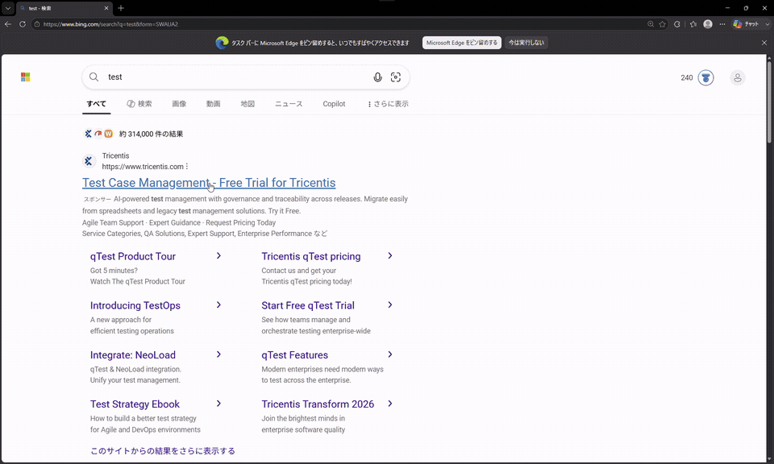

# keymouse

README: [English](README.md) | 日本語

短いラベルキーでWindowsを操作します。

[](assets/demo.mp4)

動画では、Element Modeによるリンク・ボタンの検出、ラベルの絞り込み、実クリック、
座標Gridへの切り替えを紹介しています。クリックするとフル動画を再生できます。

## 操作体験

1. `Shift+Space`で画面内のUI要素へラベルを表示
2. 小文字のラベルを入力して対象をクリック
3. 座標で選びたいときは`Shift+G`でGridを表示
4. もう一度`Shift+Space`を押してラベルを消去

クリック後も選択状態が続きます。画面を更新して次のラベル入力を待つため、マウスへ
手を伸ばさず複数の操作を続けられます。

## できること

- ボタン、リンク、入力欄、タブ、メニューなどへラベルを表示
- 選択した対象を実際のマウスクリックで操作
- UIAで認識できない場所を固定`40 × 25` Gridで選択
- 候補が少なければ一文字、必要な場合だけ二文字・三文字ラベルを使用
- `keymouse.exe inspect`でUI AutomationツリーをJSON出力

## キー操作

| キー | 動作 |
|---|---|
| `Shift+Space` | Element Modeを表示／ラベルを消去 |
| `Shift+G` | Element ModeとGrid Modeを切り替え |
| 小文字ラベル | 候補を絞り込んでクリック |
| `Backspace` | 入力を一文字戻す |
| `H/J/K/L` | ラベルを左／下／上／右へ移動 |
| `Shift+H/J/K/L` | ラベルを大きく移動 |
| `Shift+R` | ラベルを更新 |
| `Space`長押し | 一時的にラベルを隠す |
| `Esc` | 終了 |

## ビルド

```powershell
.\build.ps1
go test ./...
```

Windows 10または11に対応しています。ソースビルドにはGo 1.22以上が必要です。

## License

MIT
